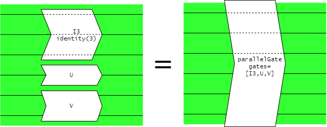
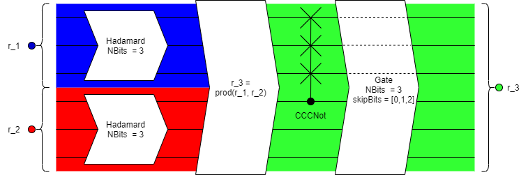

Welcome to QutiePy's documentation!
=======================================

Package Description
=====================

QutiePy is a python3 package designed to provide an easy and practical toolset for simulated quantum computing aimed users with any experience level in quantum theory
and a working knowledge of pythonic OOP.

*QutiePy is currently a work-in-progress and is being developed by a first-timer. Please report any issues or suggestions on the GitHub repo at <https://github.com/franklinscudder/QutiePy/issues>.*


Reference
==============

General Notes and Conventions
----------------------------------
- QutiePy assumes that the first bit in a register (reg[0]) is the least significant bit. Thus, if a register is observed as [0,0,1] the resulting output would be 4.
- For controlled gates, the first bit (LSB) is the control bit.
- The names used in the package use camelCase as much as possible with the caveat that 'N' as in 'number of' is capitalised and treated as a word itself (NBits, NStates).
- For a pretty representation of a register, just call print(reg).
- When calling a gate on a register, the result is returned in a new object, the original register is not modified in any way.
- All gate objects implement a __call__ method and are intended to be applied to a register in this way:

.. code-block:: python
   
   # A Hadamard gate
   h = hadamard(4)
   
   # A 4-bit register
   r = register(4)
   
   # Applying the gate to the register
   result = h(r)

- Gates can be compounded is series as a new object. ``a(b(c))`` will return a compoundGate object if a, b and c are gates.
- If reproducability is required, setSeed() can be used to set the RNG seed to a given string so that each run will produce the same results.


.. automodule:: qutiepy
   :members:
   :member-order: bysource
   :show-inheritance:


.. toctree::
   :maxdepth: 2
   :caption: Contents:

Usage Example
==================

This script demonstrates the basic usage of the module, constructing the Bell state 'Phi+'. A Bell state is a pair of qubits which exhibit maximal entanglement. They are the simplest example of this phenomenon.

*This script can be found in the examples folder of your package installation.*

.. code-block:: python

   import qutiepy as qu

   # Create two 1-qubit registers, initialised to 0 by default
   r1 = qu.register(1)
   r2 = qu.register(1)

   # Create a Hadamard and a CNOT gate
   h = qu.hadamard(1)
   cn = qu.cNot()

   # Apply the hadamard operation to r1
   r1 = h(r1)

   # 'Join' the two bits together into a single register
   r = qu.prod(r1,r2)

   # Apply the CNOT gate to the new register
   r = cn(r)

   # Analyse the resulting Bell state
   print("The state vector of r:")
   print(r)
   print()
   print("The probabilities of observing each state of r:")
   print(r.probabilities())
   print()
   print("The reduced purities of each qubit in r (0.5 = maximally entangled, 1 = fully unentangled):")
   print(r.reducedPurities())
   print()
   print("The result of observing ten versions of the Bell state r:")
   for i in range(10):
       print(r.observe(collapseStates=False)),

Entanglement and skipBits
============================
Entanglement in QutiePy is handled by keeping entangled qubits in the same register as each other. Thus, once registers are combined using ``prod()``, they cannot
be separated. The best way to apply a gate operation to only some bits in a register, you can use a ```parallelGate``` object composed of any operations you wish to apply to the gate,
along with identity gates acting on bits you wish to remain unaffected.



A gate can also be specified with a list ``skipBits`` of qubit indices to be left
unaltered by the gate. This is no longer the recommended method and is only retained for compatability reasons.
The example below shows how this can be used to transform a register which has been placed in a state of entanglement.




Indices and tables
==================

* :ref:`genindex`
* :ref:`search`
